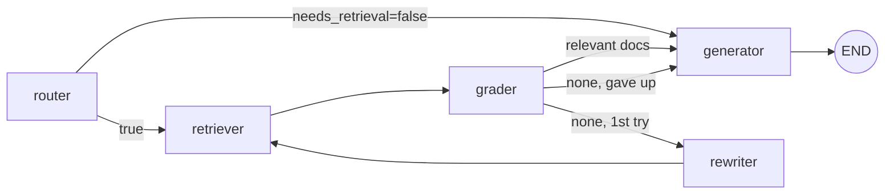

# Local RAG with multi-agent orchestration

A 100% local Retrieval-Augmented Generation stack:

| Layer            | Choice                                                     |
| ---------------- | ---------------------------------------------------------- |
| LLM              | [Ollama](https://ollama.com) (default: `llama3.1:8b`)      |
| Embeddings       | `sentence-transformers/all-MiniLM-L6-v2` (local)           |
| Vector store     | ChromaDB (persistent, on disk)                             |
| Orchestration    | LangGraph multi-agent pipeline                             |
| Backend          | FastAPI (swappable frontends)                              |
| Frontend         | Streamlit (talks to the API over HTTP only)                |

Every answer ships with the **sources** (file name, chunk text, similarity score)
and the full **agent trace** so you can see what the pipeline did.

---

## 1. Prerequisites

1. **Python 3.11+**
2. **[Ollama](https://ollama.com/download)** running locally, with a model pulled:
   ```powershell
   ollama pull llama3.1:8b
   ollama serve   # usually started automatically
   ```
3. (Optional) GPU drivers — sentence-transformers and Ollama will use them if available.

## 2. Install

```powershell
cd "C:\Users\Aurelien\Desktop\Cours\RAG"
python -m venv .venv
.\.venv\Scripts\Activate.ps1
pip install -r requirements.txt
Copy-Item .env.example .env
```

Edit `.env` if you want a different model, embedding, chunk size, etc.

## 3. Add documents

Drop PDFs / DOCX / TXT / MD / HTML files into [data/documents/](data/documents/),
or upload them later from the Streamlit UI.

Index them once:
```powershell
python scripts/ingest.py
```

## 4. Run the backend (API)

```powershell
uvicorn backend.main:app --reload --host 0.0.0.0 --port 8000
```

Open the auto-generated Swagger UI at <http://localhost:8000/docs>.

Key endpoints:

| Method | Path                 | Purpose                                     |
| ------ | -------------------- | ------------------------------------------- |
| POST   | `/api/chat`          | Ask a question; returns answer + sources + trace |
| POST   | `/api/ingest/upload` | Upload files (multipart) and index them     |
| POST   | `/api/ingest/scan`   | Re-scan the documents directory             |
| GET    | `/api/ingest/info`   | Collection name + chunk count               |
| DELETE | `/api/ingest`        | Wipe the collection                         |

Example:
```powershell
curl -X POST http://localhost:8000/api/chat `
  -H "Content-Type: application/json" `
  -d '{ "question": "Quels sont les principes du RAG ?" }'
```

## 5. Run the frontend (Streamlit)

In another terminal:
```powershell
.\.venv\Scripts\Activate.ps1
streamlit run frontend/app.py
```

The frontend reads `RAG_API_URL` (defaults to `http://localhost:8000`), so you
can point it at any deployment without changing code. Because the backend is a
pure HTTP API, you can also swap Streamlit for a React/Vue/CLI frontend.

---

## Agent orchestration

The pipeline is implemented with **LangGraph** in
[backend/agents/orchestrator.py](backend/agents/orchestrator.py).



Roles:

- **router** — LLM decides whether the question needs document retrieval at all.
- **retriever** — semantic search in Chroma (top-K cosine similarity).
- **grader** — LLM filters retrieved chunks for actual relevance (YES/NO).
- **rewriter** — if grading kills every chunk, reformulate the query once and retry.
- **generator** — final answer, grounded in the surviving chunks, with `[n]` citations.

The graph state (`RAGState`) carries the question, history, retrieved/relevant
docs and an append-only `trace`. The API surfaces both the `sources` (so the
user can verify) and the `trace` (so you can debug the agents).

## Project layout

```
backend/
  main.py              FastAPI app + CORS
  config.py            Pydantic-settings (reads .env)
  models.py            Request/response schemas
  embeddings.py        Local sentence-transformers embedding function
  vectorstore.py       ChromaDB persistent client wrapper
  ingestion.py         Loaders (PDF/DOCX/TXT/MD/HTML) + chunking + indexing
  llm.py               Ollama client
  agents/
    orchestrator.py    LangGraph multi-agent pipeline
  routes/
    chat.py            /api/chat
    ingest.py          /api/ingest/*
frontend/
  app.py               Streamlit UI (HTTP client of the API)
scripts/
  ingest.py            CLI batch indexer
data/
  documents/           Drop your source files here
  chroma/              Persistent vector store (auto-created)
```

## Swapping pieces

- **Different LLM** — `ollama pull mistral` then set `LLM_MODEL=mistral` in `.env`.
- **Different embeddings** — set `EMBEDDING_MODEL` to any sentence-transformers id.
- **Different frontend** — anything that can POST JSON to `/api/chat` works.
- **Hosted vector DB** — replace `backend/vectorstore.py` (single file).

## Troubleshooting

- *"Connection refused" on chat* → Ollama isn't running, or `LLM_MODEL` isn't pulled.
- *Empty answers* → check `/api/ingest/info`. If `count=0`, you haven't indexed anything yet.
- *First call is slow* → sentence-transformers downloads the embedding model on first use.
